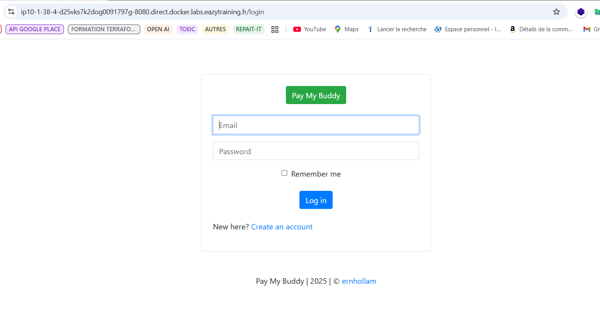

# PayMyBuddy – Dockerized Financial Transaction App

PayMyBuddy est une application Spring Boot permettant aux utilisateurs de gérer des transactions financières entre amis. Ce projet démontre le déploiement conteneurisé de l'application via Docker et Docker Compose, avec une attention portée à la sécurité, l'automatisation et la portabilité.

---

## Objectifs

- Conteneuriser le backend Spring Boot et la base MySQL
- Orchestration avec Docker Compose
- Sécuriser les secrets avec `.env`
- Préparer le déploiement vers un registre Docker privé

---

## Technologies

- Spring Boot + Java 17 (Amazon Corretto)
- MySQL 8
- Docker & Docker Compose
- `.env` pour la configuration sécurisée

---

## Dockerfile (backend)

```dockerfile
#Génération du .jar
FROM maven:3.9.6-eclipse-temurin-17 AS builder
WORKDIR /app
COPY pom.xml .
COPY src ./src
RUN mvn clean package -DskipTests

#contruction de l'image
FROM amazoncorretto:17-alpine
LABEL maintainer="Harxen" email="harold.m.kengne@gmail.com"
WORKDIR /paymybuddy
 
COPY target/*.jar paymybuddy.jar
EXPOSE 8080

ENTRYPOINT ["java", "-jar", "paymybuddy.jar"]
```

---

## Docker Compose

```yaml
version: '3.3'

services:
  paymybuddy-backend:
    image: paymybuddy-backend
    container_name: paymybuddy-backend
    depends_on:
      - paymybuddy-db
    ports:
      - "8080:8080"
    env_file:
      - ./secrets/app.env
    networks:
      - paymybuddy_network

  paymybuddy-db:
    image: mysql:8
    container_name: paymybuddy-db
    volumes:
      - ./initdb/create.sql:/docker-entrypoint-initdb.d/init.sql
      - paymybuddy-data:/var/lib/mysql
    ports:
      - "3306:3306"
    env_file:
      - ./secrets/db.env
    networks:
      - paymybuddy_network

networks:
  paymybuddy_network:
    name: paymybuddy_network
    driver: bridge

volumes:
  paymybuddy-data:
```

---

## Sécurité des secrets

Les mots de passe et identifiants de base de données sont stockés dans deux fichiers `.env` :

### `secrets/db.env`

```env
MYSQL_ROOT_PASSWORD=root
MYSQL_DATABASE=bd_paymybuddy
MYSQL_USER=appuser
MYSQL_PASSWORD=passuser
```

### `secrets/app.env`

```env
SPRING_DATASOURCE_URL=jdbc:mysql://paymybuddy-db:3306/bd_paymybuddy
SPRING_DATASOURCE_USERNAME=appuser
SPRING_DATASOURCE_PASSWORD=passuser
```

Les fichiers `.env` sont exclus du dépôt avec `.gitignore` pour plus de sécurité.

---

## Lancer le projet

### 1. Creation de l'image backend utilisée dans le docker-compose.yml

```bash
docker build -t paymybuddy-backend .
```
### 2. Démarrage des services

```bash
docker-compose up -d
```

### Accès à l'Application

```
http://localhost:8080
```

---

## Déploiement dans un Docker Registry

### 1. Création du registre

```bash
docker compose -f docker-compose-registry.yml up -d
```

### 2. Tag de l’image

```bash
docker tag paymybuddy-backend localhost:5000/paymybuddy-backend:v1
```

### 3. Push dans le registre privé

```bash
docker login localhost:5000
# username: paymybuddy
# password: change-me
docker push localhost:5000/paymybuddy-backend:v1
```

---

## Captures d’écran

> Les images sont dans `src/main/resources/readme/`

### Docker containers


### Base MySQL initialisée


### Application en cours d'exécution



### Tests de l'application


---

### Création du registre


---

## Auteur

Réalisé par Harold Kengne 

---
